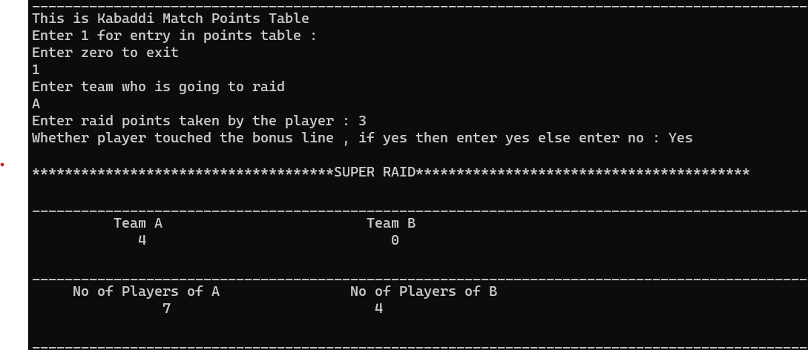
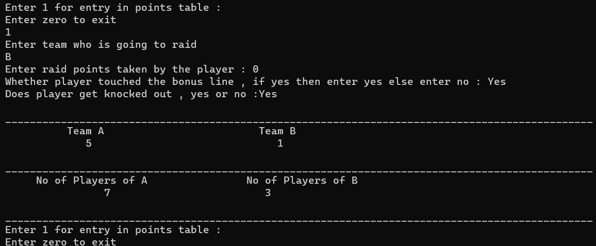
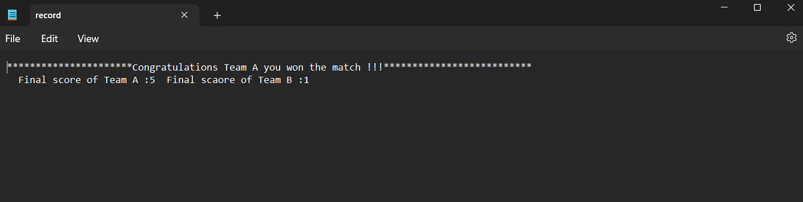

# RaidRapid-Kabaddi-Scoring-Automation

Developed a streamlined Kabaddi Points Table System to modernize local league scoring, efficiently counting various point types such as
tackle, raid, bonus, and super raid, while seamlessly storing match results in a file for enhanced management.
1. Utilized C++ Object Oriented Programming principles for the implementation along with file reading, writing operations.
2. Resulted in reducing score calculation time and winner declaration time up to 50%.

## Screenshots

- 

- 
 
- 
